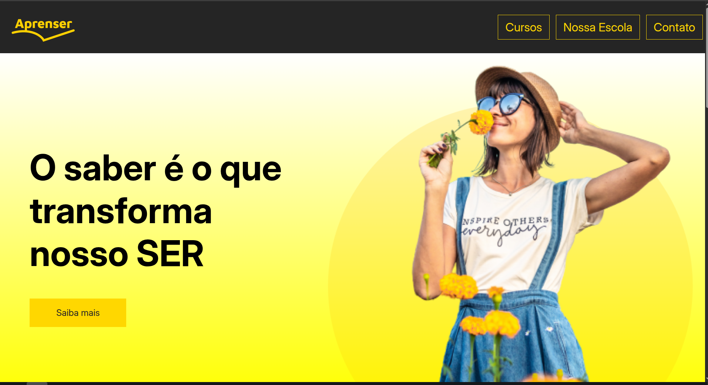

# 🏫 Quinto Desafio – Projeto Aprenser (HTML & CSS)  

Este repositório contém o **quinto desafio** que desenvolvi no curso **SerFrontend (Serliv)**, como parte do meu estágio na **SULTS**.  
O objetivo foi criar um **site para a escola fictícia Aprenser**, aplicando conceitos de **HTML e CSS** com foco em layout, tipografia e responsividade.  

---

## 📸 Demonstração do Projeto  
  

---

## 📖 Descrição  

Neste projeto, aprendi a:  
- Criar a **estrutura de um site institucional** usando HTML semântico.  
- Trabalhar com **menus de navegação** e seções de conteúdo bem organizadas.  
- Aplicar **tipografia adequada** para textos educacionais.  
- Utilizar **cores e espaçamentos** para dar clareza e harmonia ao design.  
- Criar uma página **responsiva**, adaptada a diferentes tamanhos de tela.  

Esse desafio simulou um **site real de escola**, reforçando boas práticas para projetos institucionais.  

---

## 👤 Autor  
**Yuri Duarte**  

---

## 📚 Referências  
Este projeto faz parte do curso:  
👉 [SerFrontend – Curso HTML, CSS e JS](https://serliv.com/html-css-js)  

---
